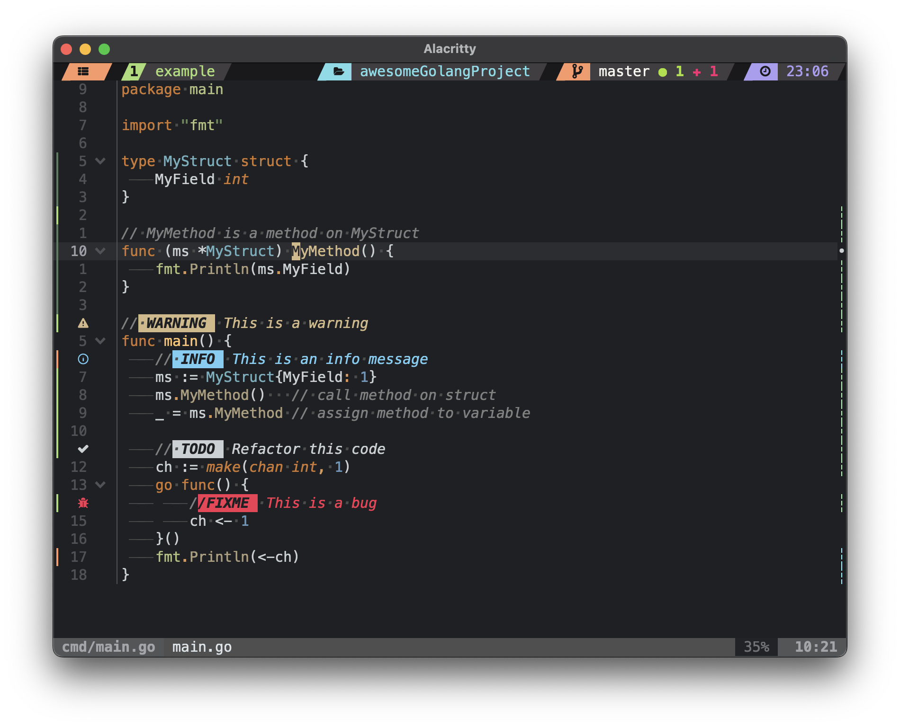

# Statuscoolumn

Neovim plugin that provides a configurable `statuscolumn`: line numbers, diagnostics, gitsigns, folds, and a border — all in one column with cursorline-aware highlighting.

## Preview


## Features

- Diagnostics and Git signs rendered side-by-side with line numbers
- Fold column with custom icons for open / closed / scope markers
- Optional border separator between the column and the buffer
- Cursorline-aware highlight pairs (each group has a `*Cursor` variant)
- Static highlight registration with `ColorScheme` re-application

## Installation

### Using a package manager (e.g., lazy.nvim)

```lua
{
  "sergei-durkin/statuscoolumn.nvim",
  event = "BufReadPre",
  config = function()
    require("statuscoolumn").setup()
  end,
}
```

## Configuration

```lua
require("statuscoolumn").setup({
  number = {
    type = "hybrid", -- "normal" | "relative" | "hybrid"
  },

  border = {
    enabled = true,
    text = "│",
  },

  fold = {
    enabled = true,
    text = {
      opened = "",
      closed = "",
      scope = " ",
    },
  },

  colors = {
    cursorline = { bg = "#383838" },
    number     = { normal = "#606684", accent = "#B9C4F8" },

    diagnostics = {
      error   = "#FF6188",
      warning = "#FFCA80",
      info    = "#A9DC76",
      hint    = "#76E3EA",
    },

    git = {
      added    = "#A6DA95",
      modified = "#EED4A0",
      removed  = "#ED8796",
    },

    git_staged = {
      added    = "#5A7C61",
      modified = "#467C7B",
      removed  = "#7F605C",
    },
  },
})
```

## Usage

The column activates automatically after `setup()`. To toggle per buffer:

```vim
:setlocal statuscolumn=
:setlocal statuscolumn=%!v:lua.require('statuscoolumn').render()
```

## Dependencies

- Neovim (0.9+)
- [gitsigns.nvim](https://github.com/lewis6991/gitsigns.nvim) — optional, for Git hunk signs
- LSP diagnostics — optional, for diagnostic signs

## License

MIT
